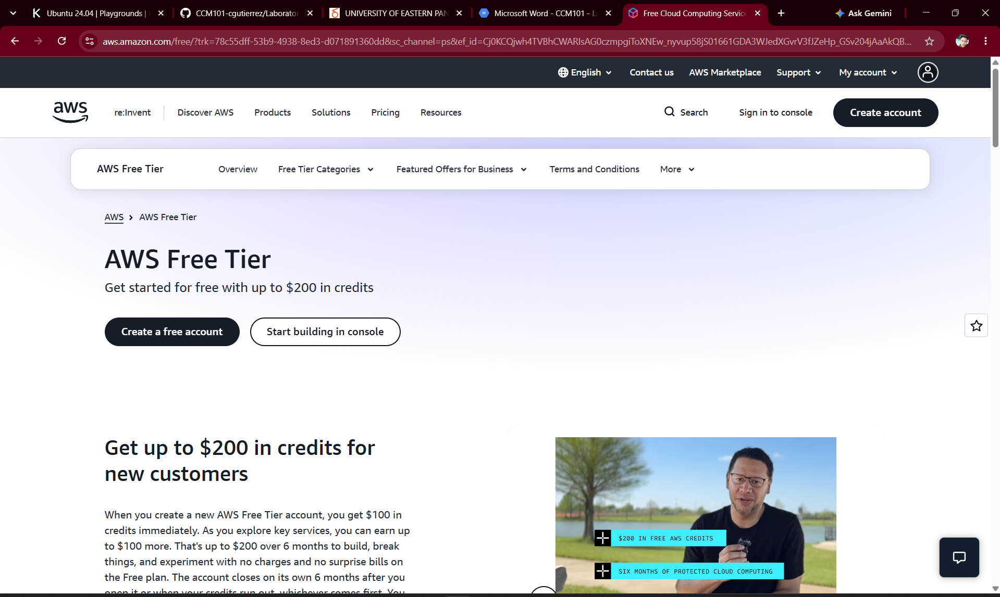

# 🟠 Amazon Web Services (AWS) Platform Research Report

> **Target Platform:** Amazon Web Services (AWS)  
> **Evaluation Role:** Cloud Evaluation Team — CloudNova Technologies  
> **Status:** `RESEARCH VERIFIED`  

---

## 1. Brief Overview
Amazon Web Services (AWS) is a comprehensive and broadly adopted cloud platform offering over 200 fully featured services from data centers globally. Launched publicly in 2006 by Amazon, AWS pioneered Infrastructure as a Service (IaaS) and remains the global market share leader in public cloud infrastructure.

## 2. Global Infrastructure
AWS operates on a global infrastructure topology comprising **AWS Regions**, **Availability Zones (AZs)**, and **Edge Locations**:
* **AWS Regions:** Geographic areas housing multiple isolated, physically separated data center clusters.
* **Availability Zones (AZs):** Discrete data centers with independent power, cooling, and physical security connected via ultra-low-latency networking.
* **Edge Locations / Points of Presence (PoPs):** Distributed content delivery networks (AWS CloudFront) used to cache media content close to end users globally.

## 3. Cloud Management Console
The **AWS Management Console** is a web-based graphical user interface (GUI) designed to manage AWS resources. It provides single sign-on access, consolidated billing insights, service search capabilities, and integrated browser-based shell access via **AWS CloudShell**.

---

## 4. Four Core Services

| Service Category | AWS Service Name | Primary Technical Purpose |
| :--- | :--- | :--- |
| **Compute** | **Amazon EC2** *(Elastic Compute Cloud)* | Scalable virtual servers on-demand with configurable vCPUs, RAM, and OS images. |
| **Storage** | **Amazon S3** *(Simple Storage Service)* | Highly durable, scalable object storage for unstructured data, backups, and static web hosting. |
| **Networking** | **Amazon VPC** *(Virtual Private Cloud)* | Provisioning isolated logical virtual networks, subnets, route tables, and Internet Gateways. |
| **Identity** | **AWS IAM** *(Identity and Access Management)* | Managing granular role-based access control (RBAC), multi-factor authentication, and API credentials. |

---

## 5. Three Key Advantages
1. **Industry-Leading Service Depth:** Features the largest and most mature ecosystem of cloud native tools, third-party integrations, and managed services.
2. **Global Reach & Scale:** Massive infrastructure presence ensuring lower latency and high availability across all continents.
3. **Flexible Pay-as-You-Go Billing:** Cost-optimization models including Reserved Instances, Savings Plans, and Spot Instances.

## 6. Typical Enterprise Use Cases
* **Enterprise Application Migration:** Re-hosting legacy enterprise workloads into scalable IaaS environments.
* **Serverless Microservices:** Running backend API microservices using AWS Lambda and Amazon API Gateway.
* **Big Data Analytics & Data Lakes:** Storing exabytes of data in S3 and processing queries using AWS Glue and Amazon Redshift.

---

## 🖼️ Visual Evidence

