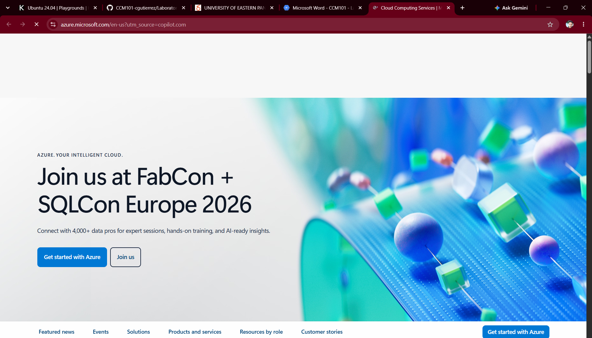

# 🔵 Microsoft Azure Platform Research Report

> **Target Platform:** Microsoft Azure  
> **Evaluation Role:** Cloud Evaluation Team — CloudNova Technologies  
> **Status:** `RESEARCH VERIFIED`  

---

## 1. Brief Overview
Microsoft Azure is a premier public cloud platform launched by Microsoft in 2010. Azure provides a flexible ecosystem supporting IaaS, PaaS, and SaaS solutions, highly optimized for hybrid cloud deployments and integration with enterprise Microsoft technologies.

## 2. Global Infrastructure
Azure's global physical architecture spans **Azure Regions**, **Region Pairs**, and **Availability Zones**:
* **Azure Regions:** Defined geographic boundaries containing sets of data centers interconnected via a dedicated latency-defined network.
* **Region Pairs:** Direct pairings within the same geography (e.g., East US and West US) to ensure high availability and disaster recovery replication.
* **Availability Zones:** Unique physical locations within an Azure region featuring independent power and networking.

## 3. Cloud Management Console
The **Azure Portal** is an intuitive, web-based hub providing a customizable dashboard interface. It features resource tagging, resource group management, integrated cloud shell execution (Bash/PowerShell), and direct integration with Microsoft Entra ID.

---

## 4. Four Core Services

| Service Category | Azure Service Name | Primary Technical Purpose |
| :--- | :--- | :--- |
| **Compute** | **Azure Virtual Machines** | On-demand Linux and Windows virtual machines supporting custom enterprise workloads. |
| **Storage** | **Azure Blob Storage** | Massive object storage solution optimized for storing unstructured data, logs, and video streaming. |
| **Networking** | **Azure Virtual Network (VNet)** | Private network isolation, subnets, VPN gateways, and Network Security Groups (NSGs). |
| **Identity** | **Microsoft Entra ID** *(formerly Azure AD)* | Cloud-based identity and access management providing single sign-on (SSO) and hybrid directory sync. |

---

## 5. Three Key Advantages
1. **Unmatched Microsoft Integration:** Turn-key integration with Active Directory, Windows Server, Office 365, and SQL Server.
2. **Hybrid Cloud Leadership:** Advanced hybrid infrastructure tooling through **Azure Arc** and **Azure Stack**.
3. **Cost Savings for Legacy Licensing:** Substantial financial benefits via Azure Hybrid Benefit when porting existing Windows/SQL licenses.

## 6. Typical Enterprise Use Cases
* **Hybrid Directory Federation:** Synchronizing on-premises Active Directory with cloud services.
* **Enterprise Resource Planning (ERP):** Hosting mission-critical enterprise platforms like SAP on Azure VMs.
* **Windows Virtual Desktop Infrastructure:** Delivering virtualized enterprise desktops via Azure Virtual Desktop.

---

## 🖼️ Visual Evidence

