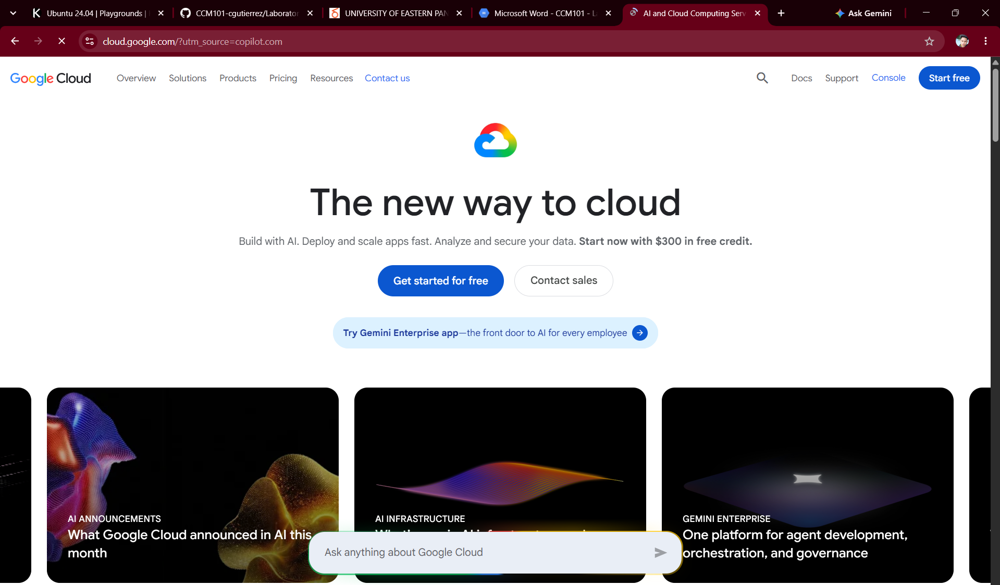

# 🟢 Google Cloud Platform (GCP) Research Report

> **Target Platform:** Google Cloud Platform (GCP)  
> **Evaluation Role:** Cloud Evaluation Team — CloudNova Technologies  
> **Status:** `RESEARCH VERIFIED`  

---

## 1. Brief Overview
Google Cloud Platform (GCP), offered by Google since 2008, provides modular cloud computing services including compute, storage, data analytics, and machine learning. Built on top of the same high-performance infrastructure that powers Google Search and YouTube, GCP is renowned for software engineering innovation.

## 2. Global Infrastructure
GCP’s global network infrastructure consists of **GCP Regions**, **Zones**, and **Global Fiber Backbone**:
* **GCP Regions:** Independent geographic areas divided into distinct physical zones.
* **Zones:** Deployment areas within a region that represent isolated fault domains.
* **Private Network Fiber:** High-speed private backbone network connecting all global data centers directly, bypassing the public internet for fast traffic routing.

## 3. Cloud Management Console
The **Google Cloud Console** provides a unified web-based administration dashboard. It offers real-time resource tracking, advanced stack monitoring, billing management, and embedded **Google Cloud Shell** pre-configured with the `gcloud` CLI SDK.

---

## 4. Four Core Services

| Service Category | GCP Service Name | Primary Technical Purpose |
| :--- | :--- | :--- |
| **Compute** | **Google Compute Engine (GCE)** | High-performance virtual machine instances running Linux or Windows. |
| **Storage** | **Google Cloud Storage (GCS)** | Global, durable object storage with automatic data lifecycle policies. |
| **Networking** | **Google Virtual Private Cloud (VPC)** | Global software-defined private virtual networks with multi-region subnets. |
| **Identity** | **Google Cloud IAM** | Fine-grained access control based on Google identities, roles, and service accounts. |

---

## 5. Three Key Advantages
1. **AI & Machine Learning Innovation:** Advanced machine learning tools, Custom Tensor Processing Units (TPUs), and Vertex AI platform capabilities.
2. **Kubernetes Pioneers:** Gold-standard managed container orchestration via **Google Kubernetes Engine (GKE)**.
3. **High-Speed Private Networking:** Industry-leading global network infrastructure offering low latency and fast data transmission.

## 6. Typical Enterprise Use Cases
* **Containerized Microservices:** Deploying and scaling enterprise Kubernetes workloads via GKE.
* **Big Data & Real-Time Analytics:** Running serverless data warehousing queries on petabyte-scale data using BigQuery.
* **AI Model Training:** Building and training machine learning models using Vertex AI and TensorFlow.

---

## 🖼️ Visual Evidence

